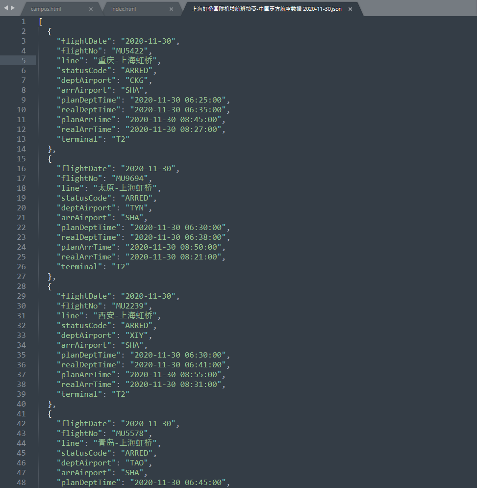

# crawlProject
大三上的爬虫作业

### 运行

直接运行`crawlProject`中的`main.py`文件，一次运行会生成一个爬取数据报告，若当天已生成报告则会覆盖。

生成数据报告命名为`上海虹桥国际机场航班动态-中国东方航空数据 [当天日期].json`。

### 数据说明

本次选取每日到达上海虹桥机场的航班信息作为爬取对象，数据来自中国东方航空（https://global.ceair.com/self-service/before/flight-status）。需要每天手动爬取一次，以获得当日数据。也可以在`main.py`中使用死循环和睡眠获得自动每日获取的效果。

爬取到的数据形如：

```json
[
  {
    "flightDate": "2020-11-30",						//航班日期
    "flightNo": "MU5422",							//航班号
    "line": "重庆-上海虹桥",							//航线信息
    "statusCode": "ARRED",							//当前状态
    "deptAirport": "CKG",							//离港机场
    "arrAirport": "SHA",							//到达机场
    "planDeptTime": "2020-11-30 06:25:00",			//原定出发时间
    "realDeptTime": "2020-11-30 06:35:00",			//实际出发时间
    "planArrTime": "2020-11-30 08:45:00",			//原定到达时间
    "realArrTime": "2020-11-30 08:27:00",			//实际到达时间
    "terminal": "T2"								//到达航站楼
  },
  ……
]
```

数据截图：

